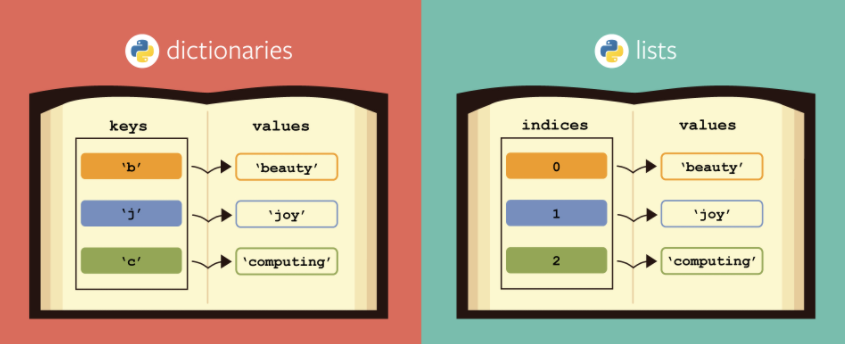

# Словари


Структура данных, позволяющая идентифицировать ее элементы не по числовому индексу, а по произвольному, называется словарем или ассоциативным массивом. Соответствующая структура данных в языке Питон называется `dict`


```python
# Создадим пустой словать languages
languages = dict()
# Заполним его несколькими значениями
languages['kg'] = 'Кыргызча'
languages['ru'] = 'Русский'


print(languages)
# {'kg': 'Кыргызча', 'ru': 'Русский'}

print(languages['kg'])
# Кыргызча

print(languages['ru'])
# Русский

# Добавим новое значение
languages['en'] = 'English'
print(languages['en'])
# English
```

## Создание словаря
Пустой словарь можно создать при помощи функции `dict()` или пустой пары фигурных скобок `{}`
```python
some_name_1 = dict()
some_name_2 = {}
```

Для создания словаря с некоторым набором начальных значений можно использовать следующие
```python
Capitals_1 = {'Russia': 'Moscow', 'Ukraine': 'Kiev', 'USA': 'Washington'}
Capitals_2 = dict(Russia = 'Moscow', Ukraine = 'Kiev', USA = 'Washington')
```

## Работа с элементами словаря
Основная операция: получение значения элемента по ключу, записывается так же, как и для списков: `A[key]`. Если элемента с заданным ключом нет в словаре, то возникает ошибка `KeyError`.

Другой способ определения значения по ключу — метод `get`: `A.get(key)`. Если элемента с ключом get нет в словаре, то возвращается значение `None`.

Для добавления нового элемента в словарь нужно просто присвоить ему какое-то значение: `A[key] = value`.

Для удаления элемента из словаря можно использовать операцию `del A[key]` (появится ошибка KeyError, если такого ключа в словаре нет.
```python
Capitals = {'Russia': 'Moscow', 'Ukraine': 'Kiev', 'USA': 'Washington'}

print(Capitals)
# {'Russia': 'Moscow', 'Ukraine': 'Kiev', 'USA': 'Washington'}
if 'Russia' in Capitals:
    del Capitals['Russia']

print(Capitals)
# {'Ukraine': 'Kiev', 'USA': 'Washington'}
```

Еще один способ удалить элемент из словаря: использование метода pop: `A.pop(key)`. Этот метод возвращает значение удаляемого элемента, если элемент с данным ключом отсутствует в словаре, то появляется ошибка. Если методу `pop` передать второй параметр, то если элемент в словаре отсутствует, то метод `pop` возвратит значение этого параметра. Это позволяет проще всего организовать безопасное удаление элемента из словаря: `A.pop(key, None)`.
```python
Capitals = {'Russia': 'Moscow', 'Ukraine': 'Kiev', 'USA': 'Washington'}

print(Capitals)
# {'Russia': 'Moscow', 'Ukraine': 'Kiev', 'USA': 'Washington'}

Capitals.pop('Russia')

print(Capitals)
# {'Ukraine': 'Kiev', 'USA': 'Washington'}

# Capitals.pop('Kyrgyzstan') # Тут возникнет ошибка, потому что ключа 'Kyrgyzstan' нету в словаре
print(Capitals.pop('Kyrgyzstan', None)) # Если добавить второй параметр, по операция .pop() вернёт значение второго параметра, если ключ не найден
# None

print(Capitals.pop('Ukraine', None))
# Kiev

print(Capitals)
# {'USA': 'Washington'}
```


## Перебор элементов словаря
Можно легко организовать перебор ключей всех элементов в словаре:
```python
Capitals = {'Russia': 'Moscow', 'Ukraine': 'Kiev', 'USA': 'Washington'}

for key in Capitals:
    print(f'The capital of {key} {Capitals[key]}')
# The capital of Russia Moscow
# The capital of Ukraine Kiev
# The capital of USA Washington
```

Второй вариант:
```python
Capitals = {'Russia': 'Moscow', 'Ukraine': 'Kiev', 'USA': 'Washington'}

for key, val in Capitals.items():
    print(f'The capital of {key} {val}')
# The capital of Russia Moscow
# The capital of Ukraine Kiev
# The capital of USA Washington
```

## Методы словарей

| Метод | Описание |
|---|---|
|dict.clear() | очищает словарь. |
|dict.copy() | возвращает копию словаря. |
|dict.get(key[, default]) | возвращает значение ключа, но если его нет, не бросает исключение, а возвращает default (по умолчанию None). |
|dict.items() | возвращает пары (ключ, значение). |
|dict.keys() | возвращает ключи в словаре.  |
|dict.pop(key[, default]) | удаляет ключ и возвращает значение. Если ключа нет, возвращает default (по умолчанию бросает исключение). |
|dict.popitem() | удаляет и возвращает пару (ключ, значение). Если словарь пуст, бросает исключение KeyError. Помните, что словари неупорядочены. |
|dict.setdefault(key[, default]) | возвращает значение ключа, но если его нет, не бросает исключение, а создает ключ с значением default (по умолчанию None). |
|dict.update([other]) | обновляет словарь, добавляя пары (ключ, значение) из other. Существующие ключи перезаписываются. Возвращает None (не новый словарь!). |
|dict.values() | возвращает значения в словаре. |


## Практика

### Количество появления буквы в строке
В единственной строке записан текст. Для кадой буквы из данного текста подсчитайте, сколько раз она встречалось в этом тексте ранее.
Например, дана строка: `If the implementation is hard to explain, it's a bad idea.`
Надо вывести:
- a - 6 `# a встречается 6 раз в строке`
- b - 1 `# b встречается 1 раз в строке`

### Количество появления цифр в списке.
Как и в предыдущей задаче, надо посчитать количество появления цифр в списке.
Список: `[9, 4, 76, 44, 3324, 9, 76, 43, 44, 34, 4, 3324, 9, 4, 43, 88, 99, 99, 99, 34, 9]`

### Выборы в нашем селе)
В нашем селе проходят выборы на пост "Айыл окмоту". 
В списке `townspeople` указаны все горожане, имеющие право голосовать.
В списке `candidates` указаны все кандидаты в "Айыл окмоту".
Напишите программу, которая будет просить пользователя ввести имя, а после попросит выбрать, за кого он проголосует.
Горожанин не может проголосовать больше одного раза.
Программа завершается, если все горожане проголосовали или если ввести вместо имени `exit`.
После завершения голосования, программа должна вывести победителя и процент проголосовавших горожан за этого кандидата.

```python
townspeople = [
    "Шабдан",
    "Аскат",
    "Эсенбек",
    "Аманбек",
    "Ильяз",
    "Данияр",
    "Байэл",
    "Саматова",
    "Алан",
    "Арли",
    "Аким",
    "Бакдоолот",
    "Азиза",
    "Айнура"
]
candidates = [
    "Бекказы",
    "Асылбек"
]
```
