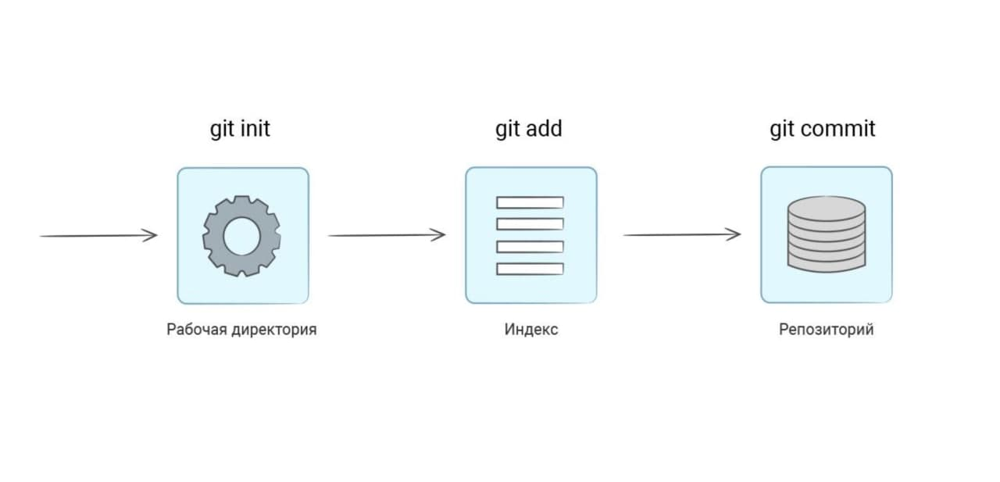
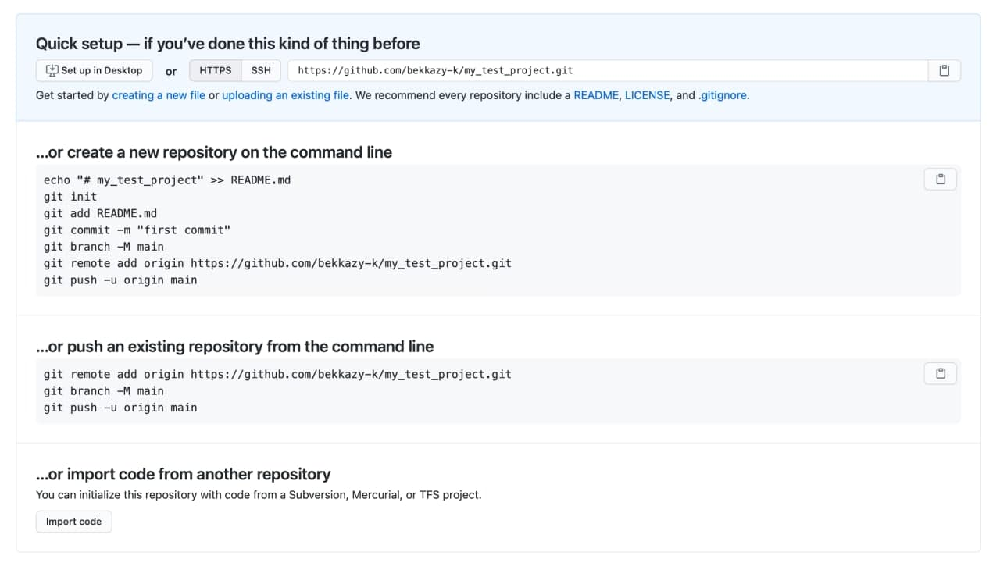
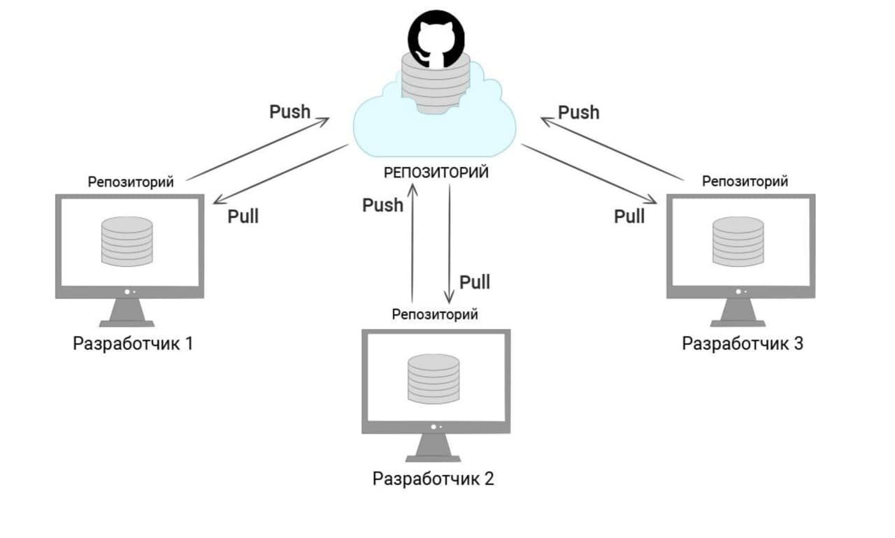

# Git
После установки git нужно зайти в терминал и проверить, что он работает:
```bash
$ git --version
git version 2.29.2
# Ваша версия может отличаться, но важно, чтобы она была не ниже 2.23.0
```

После установки git нужно настроить. Для своей работы ему важно знать ваше имя и емейл. Эти данные подставляются в историю изменений. Только так можно узнать, кто и что сделал в проекте:
```bash
$ git config --global user.name "<имя фамилия>"
$ git config --global user.email "<ваш емейл>"
```


# Рабочий процесс
Git может отслеживать файлы проекта только в том случае, когда они помещены под контроль версий. Для этого нужно зайти в директорию проекта и выполнить команду инициализации `git init`. Проект может быть как новый, так и уже существующий. Процесс инициализации от этого не поменяется.
```bash
# Создаем новый проект
$ mkdir my_test_project
# Заходим в только что созданную папку
$ cd my_test_project
# Выполняем инициализацию
$ git init
Инициализирован пустой репозиторий Git в /Users/bekkazy/Projects/Python/my_test_project/.git/
```

Команда `git init` создает репозиторий — директорию .git, которая содержит все необходимые для работы git файлы.

С помощью команды `git status` можно посмотреть статус репозитория:

```bash
$ git status
На ветке master

Еще нет коммитов

нечего коммитить (создайте/скопируйте файлы, затем запустите «git add», чтобы отслеживать их)
```
В этом выводе указано, что репозиторий пустой (Еще нет коммитов) и в него нечего добавить, так как нет новых или изменённых файлов. 
Давайте попробуем добавить файл `Readme.md`

Создайте файл `Readme.md` и напишите в этом файле что угодно

Теперь снова смотрим на статус:
```bash
$ git status
На ветке master

Еще нет коммитов

Неотслеживаемые файлы:
  (используйте «git add <файл>…», чтобы добавить в то, что будет включено в коммит)
	README.md

ничего не добавлено в коммит, но есть неотслеживаемые файлы (используйте «git add», чтобы отслеживать их)
```


Git увидел, что в проекте появился новый файл, о котором ему ничего не известно. Такие файлы помечаются как неотслеживаемые. Git не следит за изменениями в таких файлах, так как они не добавлены в репозиторий. Добавление в репозиторий происходит в два шага. Первым шагом выполняется команда подготовки файлов `git add <путь до файла>`:

```bash
$ git add README.md
```

Смотрим что произошло:
```bash
$ git status
# Часть вывода не добавлена сюда
Изменения, которые будут включены в коммит:
  (используйте «git rm --cached <файл>…», чтобы убрать из индекса)
	новый файл:    README.md
```
Файл README.md теперь находится в состоянии `"готов к фиксации изменений"` или, другими словами, файлы попадают в индекс. Под фиксацией понимается окончательное добавление в репозиторий, когда git запоминает файл навсегда и следит за всеми последующими изменениями.

Все изменения, готовые к фиксации, попадают в репозиторий с помощью коммита. Коммит — это операция, которая берёт все подготовленные изменения (они могут включать любое количество файлов) и отправляет их в репозиторий как единое целое. Вот, как он выполняется:

```bash
# -m значает message, то есть описание коммита
# Коммит можно выполнять и без флага -m
# Но тогда откроется редактор, в котором нужно будет ввести описание коммита
$ git commit -m 'add README.md'
[master (корневой коммит) 9a4af6e] add README.md
 1 file changed, 1 insertion(+)
 create mode 100644 README.md
```

Теперь файл README.md находится внутри репозитория. Убедиться в этом можно, запустив команду `git status`:
```bash
$ git status
На ветке master
нечего коммитить, нет изменений в рабочем каталоге
```



# Практика
Добавьте в репозиторий два файла двумя разными коммитами:

1. файл app.py с содержимым print("Hello, World!")
2. файл index.html с текстом <h1>Мама, я коммичу</h1>


Перед тем, как продолжить экспериментировать, добавим наш репозиторий на github.com. Сохранённый репозиторий в любой момент можно извлечь и продолжить работу в нём с последнего добавленного туда коммита. Это полезно на случай, если мы случайно удалим или изменим локальный репозиторий так, что с ним станет невозможно работать.

1. Создайте репозиторий на Гитхабе. Назовите его my_test_project. Важно, чтобы репозиторий создавался пустым, поэтому не отмечайте галочки, добавляющие файлы.
2. На странице репозитория вы увидите готовые команды для подключения созданного репозитория на Гитхабе к уже существующему репозиторию у вас на компьютере.
   


Выполните эти шаги:
```bash
$ git remote add origin https://github.com/bekkazy-k/my_test_project.git
$ git branch -M main
$ git push -u origin main

Перечисление объектов: 3, готово.
Подсчет объектов: 100% (3/3), готово.
Запись объектов: 100% (3/3), 267 bytes | 267.00 KiB/s, готово.
Total 3 (delta 0), reused 0 (delta 0), pack-reused 0
To https://github.com/bekkazy-k/my_test_project.git
 * [new branch]      main -> main
Ветка «main» отслеживает внешнюю ветку «main» из «origin».
```

После этой команды репозиторий, созданный на github.com, «соединяется» с локальным репозиторием my_test_project. В данном месте может возникнуть вопрос. Почему соединяется? Разве это не один и тот же репозиторий?

В действительности это разные репозитории. Git относится к так называемым распределённым системам контроля версий. У git нет какого-то центрального места, где бы лежал один главный репозиторий, а разработчики работали с ним со своих компьютеров. В git у каждого разработчика и даже на Github находится свой собственный полноценный репозиторий. Эти репозитории git связывает между собой общей историей и возможностью обмениваться изменениями. В примере выше именно команда git push отправляет изменения во вновь созданный репозиторий.



Прямо сейчас, после выполнения команд выше, локальный и удалённый репозиторий идентичны. Но в процессе работы они всё время расходятся, и программисты должны не забывать синхронизировать изменения: заливать в репозиторий новые коммиты и забирать оттуда коммиты, сделанные другими разработчиками.

Теперь не важно, какие изменения делаются в локальном репозитории, на Github все коммиты попадут только после команды git push. Не забывайте делать её, бывает такое, что разработчик случайно удаляет локальный репозиторий, забыв запушить (от слова push) изменения.


# Клонирование

# Получение изменений с Github

Разработчики не только отправляют изменения на Гитхаб, но и забирают изменения оттуда. Чаще всего это изменения, сделанные другими разработчиками проекта, но не обязательно. Бывает такое, что один разработчик работает над одним проектом с разных компьютеров, на каждом из которых своя собственная копия репозитория (git работает только так). В таком случае, перед началом работы нужно всегда выполнять команду git pull --rebase, которая скачивает из внешнего репозитория новые коммиты и добавляет их в локальный репозиторий.

>Обычно, в статьях пишут, что достаточно вызывать git pull, но это может приводить к созданию ненужных merge-коммитов, ухудшающих историю изменений. 

